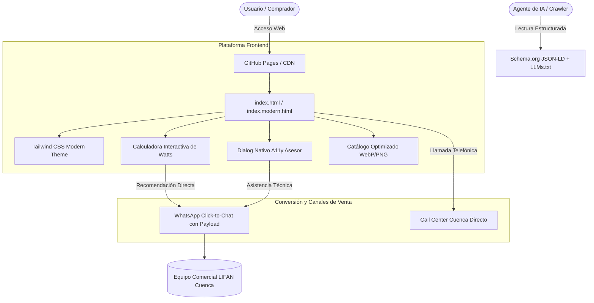
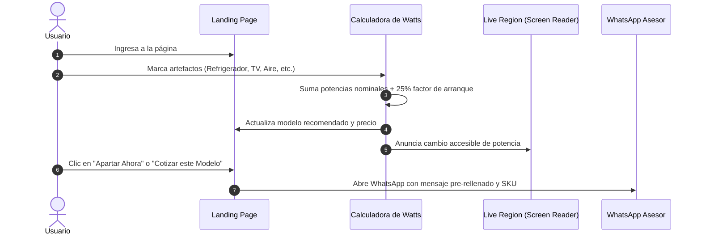

# LIFAN Power Ecuador — Plataforma Web & Landing Pages

> **Landing oficial y catálogo interactivo de generadores de energía LIFAN Power en Ecuador.**
> Respaldo comercial y técnico oficial en Cuenca con despacho inmediato a las 24 provincias ante la crisis energética nacional.

[](https://inhaus-developer-team.github.io/lifan-generadores-ecuador/)
[](https://web.dev)
[](https://www.w3.org/WAI/standards-guidelines/wcag/)
[](https://lifanpower.ec)

---

## 📌 Tabla de Contenidos

- [Visión General del Proyecto](#-visión-general-del-proyecto)
- [Arquitectura del Sistema](#-arquitectura-del-sistema)
- [Catálogo de Generadores](#-catálogo-de-generadores)
- [Estructura del Repositorio](#-estructura-del-repositorio)
- [Modern Web Guidance & Estándares 2026](#-modern-web-guidance--estándares-2026)
- [Flujo de Usuario y Calculadora Interactiva](#-flujo-de-usuario-y-calculadora-interactiva)
- [Optimización para Agentes Autónomos de IA](#-optimización-para-agentes-autónomos-de-ia)
- [Despliegue en GitHub Pages](#-despliegue-en-github-pages)
- [Desarrollo Local](#-desarrollo-local)
- [Licencia y Créditos](#-licencia-y-créditos)

---

## ⚡ Visión General del Proyecto

En el contexto de los racionamientos eléctricos prolongados en Ecuador, hogares, comercios, clínicas y talleres requieren soluciones de respaldo eléctrico confiables que no dañen sus equipos electrónicos.

**LIFAN Power Ecuador** resuelve esta problemática combinando:
1. **Tecnología Inverter de Onda Senoidal Pura (THD < 3%)**: Protección garantizada para servidores, refrigeradores inverter, tarjetas lógicas y computadoras.
2. **Sistema Dual Fuel (Gas GLP doméstico + Gasolina)**: Ahorro de combustible de hasta un 45% utilizando la bombona común de 15kg ecuatoriana, sin emisiones de humo negro ni residuos gomosos en el carburador.
3. **Respaldo Local Real**: Taller técnico oficial, ingenieros de servicio y stock inmediato de repuestos genuinos ubicado en **Cuenca, Azuay**, con envíos asegurados 24/48 horas a nivel nacional.

---

## 🏛 Arquitectura del Sistema



---

## 📦 Catálogo de Generadores

| Modelo | Tipo | Potencia Máx | Combustible | Nivel Ruido | PVP Inc. IVA | Uso Recomendado |
| :--- | :--- | :---: | :---: | :---: | :---: | :--- |
| **LIFAN 3800i** | Inverter Portátil | 3.5 kW | Gas GLP / Gasolina | ≤ 68 dB | **$690** | Casas, departamentos, WiFi, laptops, refrigeradora |
| **LIFAN 4800iE** | Inverter Silenciado | 4.2 kW | Gas GLP / Gasolina | ≤ 62 dB | **$920** | Locales, consultorios, oficinas, aires inverter |
| **LIFAN 6500iOE** | Inverter Open | 5.5 kW | Gasolina (15L) | Standard | **$860** | Jornadas continuas de hasta 10h, fincas, obras |
| **LIFAN 12000E** | Industrial Pesado | 12.0 kW | Gasolina (23L) | Industrial | **$1,955** | Talleres, bombas 220V, soldadoras, manufactura |

---

## 📂 Estructura del Repositorio

```bash
├── .github/
│   └── workflows/
│       └── deploy.yml          # Pipeline automatizado de GitHub Pages
├── docs/
│   ├── PRD.md                  # Product Requirements Document exhaustivo
│   ├── ARCHITECTURE.md         # Diagramas y decisiones de diseño técnico
│   └── AGENTS.md               # Guía de contexto para modelos de lenguaje
├── index.html                  # Landing page original sincronizada de Stitch
├── index.modern.html           # Versión modernizada bajo Modern Web Guidance
├── screen_screenshot.png       # Mockup visual de alta resolución original
├── llms.txt                    # Estándar de consumo de información para IA
├── llms-full.txt               # Especificaciones completas para asistentes
├── README.md                   # Documentación principal del proyecto
└── .gitignore                  # Exclusiones de Git
```

---

## 🚀 Modern Web Guidance & Estándares 2026

La versión [index.modern.html](file:///Users/nicolasnorton/generadores/index.modern.html) implementa las mejores prácticas del estándar web:

1. **Largest Contentful Paint (LCP) & Fetch Priority**:
   - `fetchpriority="high"` en la imagen hero destacada.
   - Dimensiones fijas explícitas (`width` y `height`) con `aspect-ratio: auto 16 / 9` para eliminar el Cumulative Layout Shift (CLS = 0).
2. **Accesibilidad (A11y)**:
   - Enlace de salto de accesibilidad (`.skip-link`) al contenido principal (`#contenido-principal`).
   - Soporte estricto de `@media (prefers-reduced-motion: reduce)`.
   - Modos de alto contraste y estados `:focus-visible` con anillo de contraste de 3:1.
   - Anunciador de región viva (`aria-live="polite"`) que comunica las recomendaciones del calculador a usuarios de lectores de pantalla.
3. **Componentes Nativos Modernos**:
   - Elemento `<dialog>` nativo con Backdrop difuminado y soporte para cierre por teclado (`Esc`) y clic exterior (`light dismiss`).
   - FAQ implementado con etiquetas semánticas `<details>` y `<summary>` sin librerías externas de JavaScript.

---

## 🧮 Flujo de Usuario y Calculadora Interactiva



---

## 🤖 Optimización para Agentes Autónomos de IA

Este repositorio incluye soporte nativo para agentes web y modelos de lenguaje de última generación:

- **Schema.org Graph JSON-LD**: Ubicado en el `<head>` del HTML, proporciona datos estructurados en formato máquina para `Organization`, `ItemList` (con cada modelo y su oferta económica en USD) y `FAQPage`.
- **`llms.txt`**: Resumen indexable de endpoints, inventario y especificaciones para navegadores con IA (ChatGPT Search, Perplexity, Gemini, Claude).
- **`llms-full.txt`**: Desglose técnico de amperajes, cilindrada, voltajes y garantía para que asistentes virtuales coticen con precisión exacta.

---

## 🌐 Despliegue en GitHub Pages

El proyecto cuenta con un workflow de GitHub Actions en `.github/workflows/deploy.yml` configurado para desplegar en cada `push` a la rama `main`.

### Pasos para activar GitHub Pages:
1. Ir al repositorio en GitHub.
2. Navegar a **Settings > Pages**.
3. En **Build and deployment > Source**, seleccionar **GitHub Actions**.
4. La landing estará disponible en:
   ```
   https://inhaus-developer-team.github.io/lifan-generadores-ecuador/
   ```

---

## 💻 Desarrollo Local

Para previsualizar y trabajar en el proyecto localmente:

```bash
# Clonar el repositorio
git clone https://github.com/Inhaus-Developer-Team/lifan-generadores-ecuador.git
cd lifan-generadores-ecuador

# Iniciar servidor local liviano con Python 3
python3 -m http.server 8085

# Abrir en el navegador
open http://localhost:8085/index.modern.html
```

---

## 📄 Licencia y Créditos

- **Distribución Comercial:** LIFAN Power Ecuador (Matriz Cuenca).
- **Desarrollo Web & Optimización:** Inhaus Developer Team.
- **Licencia:** Propietario / Todos los derechos reservados.
