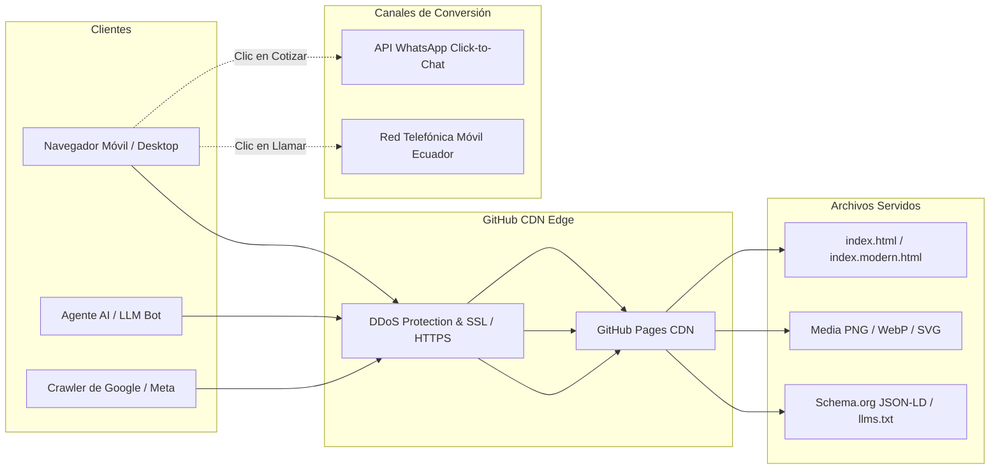
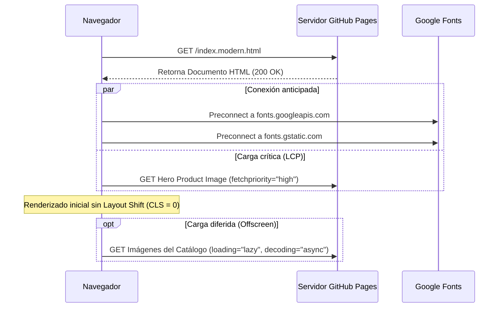
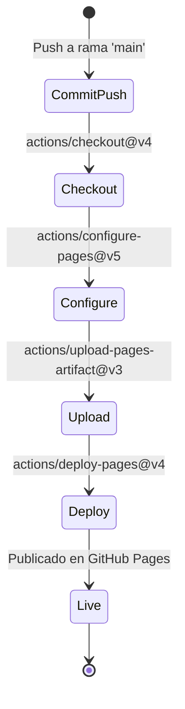

# Arquitectura Técnica del Sistema

## LIFAN Power Ecuador — Plataforma Web

---

## 1. Topología del Sistema

El proyecto está diseñado bajo el principio de **Static Web Architecture (JAMstack sin build step)**, lo que garantiza máxima resiliencia, costos de operación cero, y disponibilidad ininterrumpida aun frente a picos masivos de tráfico.

---

## 2. Decisiones de Arquitectura Frontend

### 2.1 Por qué HTML Nativo + Tailwind CSS
- **Cero tiempo de compilación (Zero Build Overhead)**: No requiere Node.js, Webpack, Vite ni frameworks con hidratación pesada (React, Next.js, Vue).
- **Time to First Byte (TTFB)** y **First Contentful Paint (FCP)** instantáneos servidos desde los puntos de presencia (PoPs) globales de GitHub Pages.
- **Resistencia al fallo**: No hay dependencias de bases de datos que puedan caer durante una crisis de demanda energética.

### 2.2 Estrategia de Priorización de Recursos (Resource Prioritization)

---

## 3. Arquitectura de Datos Semánticos (AI & Machine Agents)

Para que los agentes de IA (ChatGPT Search, Perplexity, Claude, Google Gemini) y crawlers obtengan la información del inventario de forma inmediata y sin ambigüedades, la página implementa dos capas de datos:

1. **Schema.org JSON-LD Graph**:
   - `Organization`: Razón social, país (`EC`), ciudad (`Cuenca`), número telefónico de soporte y URL oficial.
   - `ItemList`: Relación formal de los cuatro modelos de generadores con sus campos `name`, `image`, `description`, `sku`, `offers.price` (en USD) y `offers.availability`.
   - `FAQPage`: Banco de preguntas y respuestas técnicas para enriquecer los resultados de búsqueda con fragmentos destacados (Rich Snippets).

2. **Estándar LLMs.txt (`/llms.txt` y `/llms-full.txt`)**:
   - Archivos de texto plano en la raíz del dominio para que cualquier scraper de IA procese el catálogo con 0% de alucinación en capacidades y precios.

---

## 4. Pipeline de CI/CD (GitHub Actions)

El flujo de despliegue automatizado está definido en `.github/workflows/deploy.yml`:

