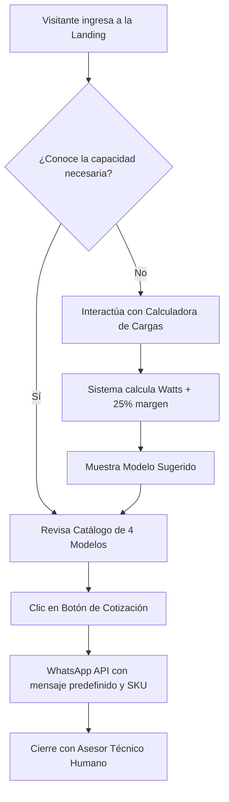

# Product Requirements Document (PRD)

## Proyecto: LIFAN Power Ecuador — Landing Page de Conversión & Catálogo
**Versión:** 2.0.0 (Estándares Octubre 2026)  
**Estado:** Listo para Producción / Despliegue  
**Propietario:** Inhaus Developer Team  
**Cliente/Marca:** LIFAN Power Ecuador  

---

## 1. Contexto & Oportunidad de Negocio

### 1.1 El Problema
Ecuador enfrenta una crisis de estiaje prolongada que genera racionamientos diarios de energía eléctrica (cortes de 4 a 12 horas).
- Los generadores tradicionales a gasolina son ruidosos (≥ 85 dB), emiten humos tóxicos, consumen combustible caro y entregan corriente sucia con picos de voltaje que queman refrigeradores inverter, televisores, impresoras térmicas y computadoras.
- La oferta del mercado informal está plagada de equipos sin respaldo técnico ni repuestos, dejando a los compradores desamparados.

### 1.2 La Solución
Una plataforma digital de alta conversión, ágil y accesible, que presenta la propuesta de valor de **LIFAN Power Ecuador**:
- **Generadores Inverter con Onda Senoidal Pura**: Protegen al 100% los equipos electrónicos.
- **Sistema Dual Fuel (Gas GLP + Gasolina)**: Reduce el gasto operativo hasta un 45% utilizando la bombona de gas doméstico ecuatoriano de 15kg.
- **Respaldo Integral en Cuenca**: Despacho formal con factura legal, 1 año de garantía y bodega de repuestos directos a las 24 provincias.

---

## 2. Objetivos del Producto (KPIs)

1. **Tasa de Conversión a WhatsApp (CR > 8.5%)**: Generar cotizaciones directas mediante enlaces inteligentes de click-to-chat con payload contextualizado por producto.
2. **Tiempo de Carga & Core Web Vitals**:
   - LCP (Largest Contentful Paint) < 1.2s en conexiones móviles 4G.
   - CLS (Cumulative Layout Shift) = 0.
   - INP (Interaction to Next Paint) < 100ms.
3. **Accesibilidad WCAG 2.1 AA**: Navegación completa por teclado, etiquetas ARIA adecuadas y región en vivo para actualizaciones dinámicas.
4. **Indexabilidad por Agentes Autónomos**: Capacidad de ser interpretado directamente por agentes LLM sin necesidad de renderizado JavaScript complejo.

---

## 3. Público Objetivo (User Personas)

| Perfil | Caso de Uso | Dolor Principal | Solución LIFAN Recomendada |
| :--- | :--- | :--- | :--- |
| **Familias / Departamentos** | Iluminación, refrigerador, WiFi y TV durante cortes nocturnos. | Ruido que molesta a los vecinos y peso excesivo para mover el equipo. | **LIFAN 3800i (21 kg, 3.5 kW, Gas GLP)** |
| **Comercios / Consultorios** | Clínicas dentales, farmacias, cafeterías, oficinas y estudios. | Pérdida de ventas, daño a equipos médicos/pos y arranque complejo. | **LIFAN 4800iE (4.2 kW, Silencioso 62dB, Encendido Eléctrico)** |
| **Fincas / Pequeña Industria** | Bombas de agua, iluminación perimetral y refrigeración de leche. | Necesidad de operar 8 a 10 horas continuas sin apagarse. | **LIFAN 6500iOE (5.5 kW, Tanque 15L, 10h)** |
| **Industria Pesada / Talleres** | Soldadoras de arco, compresores de aire 220V y maquinaria trifásica. | Falta de amperaje y potencia para arranque de motores inductivos. | **LIFAN 12000E (12.0 kW, 688cc V-Twin)** |

---

## 4. Requisitos Funcionales

### 4.1 Header y Navegación
- Logotipo oficial de LIFAN Power Ecuador con retorno a inicio.
- Navegación ancla suave (`Modelos`, `Calculadora`, `Tecnología`, `Garantía`, `Preguntas`).
- Botón de acceso al modal del **Asesor Inteligente**.
- Botón directo de cotización vía WhatsApp.

### 4.2 Hero Section de Alta Conversión
- Badge de respaldo oficial: "Distribución Oficial en Cuenca · Despacho a todo el Ecuador".
- Título orientado al beneficio inmediato: "Energía continua y segura ante los racionamientos eléctricos".
- Badges de confianza: Factura legal, 1 año de garantía y despacho asegurado 24-48h.
- Tarjeta destacada del modelo más vendido (**4800iE**) con imagen priorizada LCP (`fetchpriority="high"`).

### 4.3 Herramienta Interactiva: Calculadora de Watts
- Selectores rápidos de artefactos (Refrigerador Inverter, WiFi, Computadoras, TV, Aire Acondicionado, Bomba de Agua, Maquinaria).
- Cálculo dinámico en tiempo real sumando potencias nominales con un **factor de seguridad del 25%** para compensar picos de inductancia en el arranque.
- Actualización dinámica del modelo sugerido, su precio facturado con IVA y botón directo a su ficha.
- Notificación accesible en tiempo real mediante `role="status"` y `aria-live="polite"`.

### 4.4 Catálogo de Productos
- 4 tarjetas estructuradas con imágenes de producto con bordes contrastados.
- Especificaciones clave: Potencia máxima (kW), tipo de combustible, nivel de ruido y tipo de encendido.
- Precio transparente en dólares americanos con IVA incluido.
- Enlace WhatsApp con texto codificado específico (`URL-encoded`) para cada producto.

### 4.5 Sección Técnica de Valor Agregado
- Comparativa de la onda senoidal pura (THD < 3%) frente a generadores tradicionales.
- Explicación del sistema Dual Fuel y el ahorro de hasta el 45% con gas doméstico.
- Garantía oficial y bodega física de repuestos en Cuenca.

### 4.6 Preguntas Frecuentes Semánticas
- Acordeones nativos `
` / `
` para resolución rápida de objeciones (conexión al tablero con conmutador manual/automático, funcionamiento con gas y tiempos de envío nacional).

### 4.7 Asesor Rápido en Modal Nativo (`<dialog>`)
- Activación accesible con soporte nativo de `.showModal()`.
- Cierre mediante tecla `Escape`, botón de salida o clic fuera del contenedor (`light dismiss`).

---

## 5. Requisitos No Funcionales & Estándares Técnicos

1. **Cero Dependencias Pesadas**: Maquetado en HTML5 puro con utilidades CSS (Tailwind CSS) y JavaScript vanilla ligero.
2. **Compatibilidad Multi-Dispositivo**: Totalmente adaptativo (Mobile-First, Tablets, Laptops y Pantallas Ultra-Wide).
3. **Seguridad y Privacidad**:
   - Enlaces externos con `rel="noopener noreferrer"`.
   - Sin trackers invasivos ni cookies de terceros.
4. **Infraestructura de Alojamiento**: Despliegue sin costo ni mantenimiento sobre infraestructura global de **GitHub Pages (Edge CDN)**.
